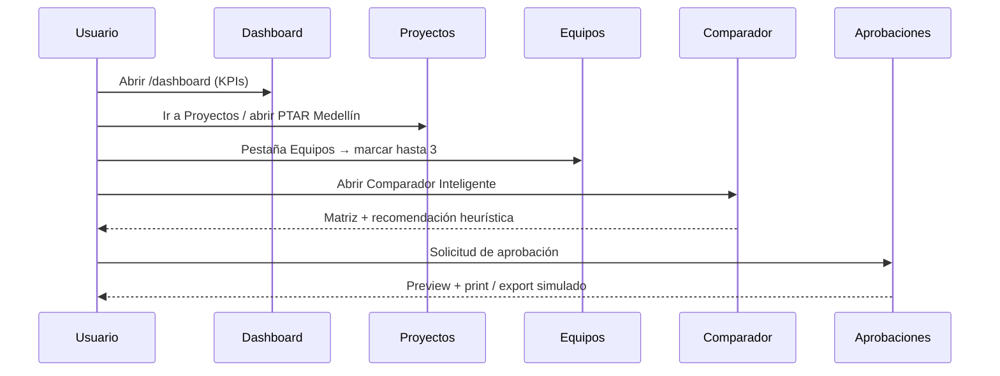

# ProManage Engineering

Prototipo funcional en **Angular 21** para gestión documental, inventario técnico, comparación de equipos y solicitudes de aprobación en proyectos de ingeniería (PTAR / plantas de tratamiento).

La aplicación es un **frontend standalone** con datos en memoria. No hay backend, autenticación ni persistencia: al recargar el navegador se restablecen los datos semilla.

---

## Tabla de contenidos

1. [Visión del producto](#1-visión-del-producto)
2. [Stack tecnológico](#2-stack-tecnológico)
3. [Requisitos e instalación](#3-requisitos-e-instalación)
4. [Arquitectura](#4-arquitectura)
5. [Estructura del repositorio](#5-estructura-del-repositorio)
6. [Modelo de dominio](#6-modelo-de-dominio)
7. [Capa de datos (`DataService`)](#7-capa-de-datos-dataservice)
8. [Rutas y navegación](#8-rutas-y-navegación)
9. [Procesos y flujos de negocio](#9-procesos-y-flujos-de-negocio)
10. [Flujo demo end-to-end](#10-flujo-demo-end-to-end)
11. [Limitaciones del prototipo](#11-limitaciones-del-prototipo)
12. [Scripts disponibles](#12-scripts-disponibles)

---

## 1. Visión del producto

ProManage Engineering centraliza, en una sola SPA, el ciclo de trabajo típico de un proyecto de ingeniería electromecánica:

| Etapa | Qué hace el usuario en la app |
|-------|-------------------------------|
| Organizar | Crear y abrir **proyectos** (carpetas de obra) |
| Documentar | Cargar **documentos** por carpeta (planos, fichas, cotizaciones…) |
| Registrar | Mantener un **inventario técnico** de equipos por proceso de planta |
| Evaluar | Comparar hasta **3 equipos** con matriz técnica y ranking heurístico |
| Cotizar | Consultar **cotizaciones** y **proveedores** asociados |
| Aprobar | Generar **solicitudes de aprobación** y exportar (simulado) |
| Reportar | Ver **KPIs** globales y por proyecto |

Dominio de demo: plantas PTAR (Medellín, Cali, Bogotá) con bombas, sopladores y equipos de aireación.

---

## 2. Stack tecnológico

| Tecnología | Uso |
|------------|-----|
| **Angular 21** | Framework (standalone components, sin NgModules) |
| **Zoneless change detection** | Actualización de UI vía Angular Signals |
| **Angular Router** | Navegación SPA |
| **Angular Forms** | Búsqueda global y formularios de alta |
| **RxJS** | Lectura de params de ruta (`paramMap`) |
| **SCSS** | Design system global + estilos por página |
| **IBM Plex Sans** + **Material Symbols** | Tipografía e iconografía |

**No incluye:** Angular Material, NgRx, HttpClient, autenticación, i18n, tests unitarios configurados.

Moneda de UI: **COP**. Idioma: **español**.

---

## 3. Requisitos e instalación

### Requisitos

- Node.js **20+** (LTS recomendado)
- npm **10+** (el lockfile usa npm 11)

### Instalación y arranque

```bash
npm install
npm start
```

La app queda en [http://localhost:4200/](http://localhost:4200/).

### Build de producción

```bash
npm run build
```

Salida en `dist/`.

---

## 4. Arquitectura

```
┌──────────────────────────────────────────────────────────┐
│  index.html + styles.scss (tokens, botones, tablas…)     │
└────────────────────────────┬─────────────────────────────┘
                             │
┌────────────────────────────▼─────────────────────────────┐
│  main.ts → bootstrapApplication(App, appConfig)          │
│  providers: router + zoneless + error listeners          │
└────────────────────────────┬─────────────────────────────┘
                             │
┌────────────────────────────▼─────────────────────────────┐
│  App (shell)                                             │
│  · Sidebar de navegación                                 │
│  · Topbar (búsqueda global + avatar cosmético)           │
│  · <router-outlet />                                     │
└────────────────────────────┬─────────────────────────────┘
                             │
              ┌──────────────┴──────────────┐
              │  Pages (standalone)         │
              │  dashboard, proyectos, …    │
              └──────────────┬──────────────┘
                             │ inject(DataService)
              ┌──────────────▼──────────────┐
              │  DataService (signals)      │
              │  + promanage.models.ts      │
              └─────────────────────────────┘
```

**Principios:**

- Una página = un feature bajo `src/app/pages/`.
- Estado global mínimo en un único servicio root con **Signals**.
- Sin capa HTTP: todo es mock en memoria.
- Layout en el componente raíz (`App`); la carpeta `layout/` está reservada pero vacía.

---

## 5. Estructura del repositorio

```
GESTION_PROYECTOS_FRONT/
├── angular.json
├── package.json
├── public/
│   └── favicon.ico
├── src/
│   ├── index.html
│   ├── main.ts
│   ├── styles.scss                 # Design system global
│   └── app/
│       ├── app.ts / app.html / app.scss   # Shell (sidebar + topbar)
│       ├── app.config.ts
│       ├── app.routes.ts
│       ├── core/
│       │   ├── models/promanage.models.ts
│       │   └── services/data.service.ts   # Store mock + APIs locales
│       ├── layout/                 # Reservado (vacío)
│       └── pages/
│           ├── dashboard/
│           ├── projects/
│           ├── project-detail/
│           ├── inventory/
│           ├── suppliers/
│           ├── matrices/
│           ├── comparator/
│           ├── quotations/
│           ├── approvals/
│           ├── reports/
│           └── settings/
└── README.md
```

Cada página sigue el patrón: `*.page.ts` + `*.page.html` + `*.page.scss`.

---

## 6. Modelo de dominio

Definido en `src/app/core/models/promanage.models.ts`.

### Project

| Campo | Descripción |
|-------|-------------|
| `id`, `name`, `client`, `location` | Identidad y ubicación |
| `engineer`, `startDate` | Responsable y fecha |
| `status` | `Activo` \| `En revisión` \| `Cerrado` |
| `progress` | Avance 0–100 |
| `description` | Alcance técnico |

**Datos semilla:** `p1` PTAR Medellín, `p2` PTAR Cali, `p3` PTAR Bogotá.

### Equipment

Equipo técnico ligado a un proyecto, con:

- Metadatos de proceso PTAR (`proceso`, `cantidad`, especificaciones, dimensiones, fuente O&M, nota).
- Fabricante, proveedor, modelo, precio, imagen.
- `status`: `Registrado` \| `En evaluación` \| `Aprobado` \| `Rechazado` \| `Pendiente`.
- `specs`: caudal, potencia, voltaje, RPM, material, garantía, días de entrega, % cumplimiento.
- `files[]`: adjuntos tipados (`imagen`, `ficha`, `plano`, `manual`, `cotizacion`, `otro`).
- `history[]`: timeline de eventos.

### Supplier / Quotation / DocumentItem

- **Supplier:** directorio con país, rating, contactos y categorías.
- **Quotation:** cotización por proyecto/equipo con estado `Pendiente` \| `Aprobada` \| `Rechazada`.
- **DocumentItem:** archivo lógico dentro de una carpeta documental del proyecto.

### Procesos de planta (inventario)

Al registrar un equipo, el formulario ofrece procesos típicos PTAR:

1. Entrada / Canal de aproximación  
2. Cribado fino  
3. Filtro percolador (tratamiento biológico)  
4. Bombeo de lodos  
5. Aireación  
6. Clarificación secundaria  
7. Otro  

---

## 7. Capa de datos (`DataService`)

Archivo: `src/app/core/services/data.service.ts`  
`providedIn: 'root'` — actúa como **única fuente de verdad**.

### Señales de estado

| Señal | Contenido |
|-------|-----------|
| `projects` | Listado de proyectos |
| `equipment` | Inventario técnico global |
| `suppliers` | Proveedores |
| `quotations` | Cotizaciones |
| `documents` | Documentos por proyecto |
| `searchQuery` | Texto de búsqueda global (topbar) |
| `selectedEquipmentIds` | Hasta 3 IDs para el comparador |
| `stats` (computed) | KPIs del dashboard |

### Operaciones principales

| Método | Proceso |
|--------|---------|
| `addProject` | Alta de proyecto → genera `id` tipo `p{timestamp}` |
| `addEquipment` | Alta de equipo desde formulario (estado inicial `Registrado`) |
| `updateEquipmentNote` | Actualiza nota técnica |
| `addEquipmentFiles` | Adjunta archivos a un equipo existente |
| `addDocument` | Agrega documento a una carpeta del proyecto |
| `toggleCompareEquipment` | Marca/desmarca equipo para comparar (máx. 3) |
| `clearCompareSelection` | Limpia selección del comparador |
| `getSelectedEquipment` | Devuelve equipos seleccionados |
| `projectIndicators` | Métricas derivadas por proyecto |
| `getProject` / `getEquipmentByProject` / … | Lecturas filtradas |

> Los cambios viven solo en memoria del navegador. No hay `localStorage` ni API REST.

---

## 8. Rutas y navegación

Definidas en `src/app/app.routes.ts` (carga eager, sin lazy loading).

| Ruta | Página | En menú lateral |
|------|--------|-----------------|
| `/` | Redirige a `dashboard` | — |
| `/dashboard` | Dashboard global | Sí |
| `/proyectos` | Listado de proyectos | Sí |
| `/proyectos/:id` | Detalle del proyecto (8 pestañas) | No (desde listado) |
| `/inventario` | Inventario técnico transversal | Sí |
| `/proveedores` | Directorio de proveedores | Sí |
| `/matrices` | Acceso a matrices / selección previa | Sí |
| `/comparador` | Comparador inteligente | No (enlaces internos) |
| `/cotizaciones` | Cotizaciones globales | Sí |
| `/aprobaciones` | Solicitudes de aprobación | Sí |
| `/reportes` | Reportes y resumen | Sí |
| `/configuracion` | Preferencias (solo lectura) | Sí |
| `/**` | Redirige a `dashboard` | — |

### Shell de aplicación

- **Sidebar:** brand “ProManage Engineering” + `navItems`.
- **Topbar:** búsqueda que escribe en `DataService.searchQuery`, botón de notificaciones (sin lógica) y avatar fijo `IR`.
- **Área principal:** `<router-outlet />`.

---

## 9. Procesos y flujos de negocio

### 9.1 Dashboard global (`/dashboard`)

**Objetivo:** vista ejecutiva del portafolio.

**Proceso:**

1. Se calculan KPIs desde `stats`: proyectos activos, equipos registrados, proveedores, cotizaciones pendientes, equipos aprobados/rechazados.
2. Se muestra un gráfico de barras (CSS) con el avance de cada proyecto.
3. Pie chart estático por categorías (Documental / Equipos / Cotizaciones / Aprobaciones).
4. Accesos rápidos a proyectos recientes y CTA **Nuevo Proyecto** → `/proyectos`.

```mermaid
flowchart LR
  A[Usuario entra a Dashboard] --> B[Lee stats computed]
  B --> C[KPIs + gráficos]
  C --> D{Acción}
  D -->|Ver proyecto| E[/proyectos/:id]
  D -->|Nuevo| F[/proyectos]
```

---

### 9.2 Gestión de proyectos (`/proyectos` → `/proyectos/:id`)

**Objetivo:** organizar cada obra como carpeta-proyecto con módulos internos.

#### Alta de proyecto

1. En `/proyectos`, abrir modal **Nuevo Proyecto**.
2. Completar: nombre, cliente, ubicación, ingeniero, descripción.
3. `addProject()` crea el registro y la UI navega al detalle.

#### Detalle del proyecto — 8 pestañas

| Pestaña | Proceso |
|---------|---------|
| **Información General** | Consulta metadatos y descripción del proyecto |
| **Documentos** | Gestor por carpetas + carga drag & drop / file input |
| **Equipos** | Tabla filtrable, drawer de detalle, selección para comparar (máx. 3) |
| **Proveedores** | Lista de proveedores cuyo nombre aparece en equipos del proyecto |
| **Matrices** | Puente hacia el comparador |
| **Cotizaciones** | Cotizaciones filtradas por `projectId` |
| **Reportes** | Indicadores `projectIndicators()` |
| **Dashboard del Proyecto** | KPIs locales + preview SAE + export PDF/Word simulado |

#### Flujo documental

Carpetas disponibles:

- Documentos  
- Planos  
- Fichas Técnicas  
- Cotizaciones  
- Solicitudes de Aprobación  
- Fotografías  

**Proceso de carga:**

1. Seleccionar carpeta activa (`docFolder`).
2. Arrastrar archivos o usar input.
3. `addDocument()` guarda **metadatos** en memoria (nombre, tipo, tamaño, fecha). No hay almacenamiento real de binarios.

```mermaid
flowchart TD
  P[/proyectos] --> M[Modal Nuevo Proyecto]
  M --> DS[addProject]
  DS --> D[/proyectos/:id]
  D --> T{Pestaña}
  T --> Info
  T --> Docs[Documentos]
  T --> Eq[Equipos]
  T --> Prov[Proveedores]
  T --> Mat[Matrices]
  T --> Cot[Cotizaciones]
  T --> Rep[Reportes]
  T --> Dash[Dashboard proyecto]
  Docs --> Upload[Drag & drop / input]
  Upload --> addDocument
  Eq --> Compare[toggleCompareEquipment]
  Compare --> Comp[/comparador]
```

---

### 9.3 Inventario técnico (`/inventario`)

**Objetivo:** catálogo transversal de equipos por proceso de planta, independiente de la vista por proyecto.

**Procesos:**

1. **Listar / filtrar** equipos (filtro local + `searchQuery` global).
2. **Nuevo Equipo** (modal):
   - Proyecto destino, proceso PTAR, nombre, cantidad.
   - Especificaciones, dimensiones, material, fuente O&M, nota.
   - Adjuntos por categoría (`imagen`, `ficha`, `plano`, `manual`, `cotizacion`, `otro`).
   - `addEquipment()` → estado inicial `Registrado`.
3. **Drawer de detalle:** ver ficha, historial, archivos; guardar nota con `updateEquipmentNote`.
4. **Comparar / Quitar:** integra con la selección global del comparador.

---

### 9.4 Matrices y comparador inteligente (`/matrices` → `/comparador`)

**Objetivo:** evaluación técnica lado a lado de candidatos.

#### Selección

- Desde Inventario, detalle de proyecto (pestaña Equipos) o Matrices.
- `toggleCompareEquipment(id)`: máximo **3** equipos; si ya hay 3, no agrega más.
- `clearCompareSelection()` limpia la selección.

#### Matriz comparativa

Criterios evaluados:

| Criterio | Mejor cuando… |
|----------|----------------|
| Caudal | Mayor |
| Potencia | Menor (eficiencia) |
| Voltaje | Mayor |
| RPM | Mayor |
| Material | Preferencia inox / duplex |
| Garantía | Mayor duración |
| Tiempo de entrega | Menor |
| Precio | Menor |
| Cumplimiento técnico | Mayor |

La UI resalta best/worst por fila según `higherIsBetter`.

#### “Panel de IA” (heurística local)

No hay llamada a un modelo externo. El ranking usa:

```
score = cumplimiento × 2 − días_entrega + (100 − potencia)
```

Se recomienda el equipo con mayor score y se muestra un texto explicativo.

#### Continuación del flujo

Desde el comparador hay CTA hacia **Solicitudes de Aprobación** (`/aprobaciones`).

```mermaid
flowchart LR
  S[Seleccionar ≤3 equipos] --> C[/comparador]
  C --> M[Matriz best/worst]
  C --> R[Ranking heurístico]
  R --> A[/aprobaciones]
```

---

### 9.5 Solicitudes de aprobación (`/aprobaciones`)

**Objetivo:** generar el documento de solicitud de aprobación de equipo (SAE) para impresión/exportación.

**Proceso actual del prototipo:**

1. Fija proyecto demo **`p1` (PTAR Medellín)**.
2. Equipo = primero de la selección del comparador, o el primer equipo de `p1` si no hay selección.
3. El usuario puede editar:
   - Nombre del logo (solo string; no sube imagen real).
   - Observaciones del proyecto.
4. Preview del documento en pantalla.
5. Acciones:
   - `window.print()` — impresión del navegador.
   - Export PDF / Word — descarga de **archivo de texto** (`.txt` / `.doc`), no PDF/DOCX reales.

---

### 9.6 Proveedores (`/proveedores`)

**Objetivo:** directorio de proveedores evaluados.

Muestra rating, país, categorías y contacto. Datos de solo lectura desde el seed (sin CRUD en UI).

---

### 9.7 Cotizaciones (`/cotizaciones`)

**Objetivo:** seguimiento comercial de ofertas.

Tabla global con proyecto, equipo, proveedor, monto (COP) y estado:

- Pendiente  
- Aprobada  
- Rechazada  

También visibles filtradas dentro del detalle de cada proyecto.

---

### 9.8 Reportes (`/reportes`)

**Objetivo:** resumen analítico del prototipo.

- Reutiliza `stats` globales.
- Lista capacidades del sistema (documental, comparación, aprobaciones, etc.).
- No genera reportes persistidos ni conecta con BI externo.

---

### 9.9 Configuración (`/configuracion`)

**Objetivo:** pantalla de preferencias (informativa).

Valores mostrados en solo lectura:

- Tema claro  
- Idioma ES  
- Moneda COP  
- Exportación simulada  

No hay guards ni preferencias persistidas.

---

### 9.10 Búsqueda global (topbar)

**Proceso:**

1. El usuario escribe en el input del topbar.
2. `App.onSearch` actualiza `DataService.searchQuery`.
3. Páginas que lo consumen (p. ej. Inventario) filtran sus listados en tiempo real vía `computed()`.

---

## 10. Flujo demo end-to-end

Recorrido recomendado para presentar el prototipo:



**Pasos en la UI:**

1. **Dashboard** → revisar KPIs y gráficos.  
2. **Proyectos** → abrir 📁 **PTAR Medellín** (o crear uno nuevo).  
3. Pestaña **Equipos** → seleccionar hasta 3 equipos.  
4. Ir a **Comparador Inteligente** → revisar matriz y recomendación.  
5. **Solicitudes de Aprobación** → ajustar observaciones y exportar (simulado).

Alternativa: registrar un equipo nuevo desde **Inventario Técnico** y luego incluirlo en la comparación.

---

## 11. Limitaciones del prototipo

| Área | Estado actual |
|------|----------------|
| Backend / API | No existe |
| Autenticación / roles | No implementados (app abierta) |
| Persistencia | Solo memoria; se pierde al recargar |
| Upload real de archivos | Solo metadatos / object URLs locales |
| Export PDF/Word | Simulado (blob de texto) |
| IA del comparador | Heurística local, sin API |
| Tests | Script `ng test` presente; sin target/config de test en `angular.json` |
| Notificaciones | Botón cosmético sin lógica |

---

## 12. Scripts disponibles

| Comando | Descripción |
|---------|-------------|
| `npm start` | Servidor de desarrollo (`ng serve`) en `:4200` |
| `npm run build` | Build de producción |
| `npm run watch` | Build en modo watch (development) |
| `npm test` | Script declarado; infraestructura de tests no configurada |

---

## Mapa rápido de archivos clave

| Rol | Ruta |
|-----|------|
| Bootstrap | `src/main.ts` |
| Providers | `src/app/app.config.ts` |
| Rutas | `src/app/app.routes.ts` |
| Shell | `src/app/app.ts` |
| Modelos | `src/app/core/models/promanage.models.ts` |
| Estado / mock | `src/app/core/services/data.service.ts` |
| Design system | `src/styles.scss` |

---

## Licencia / uso

Proyecto privado (`"private": true` en `package.json`). Prototipo de demostración para gestión de proyectos de ingeniería.
)
